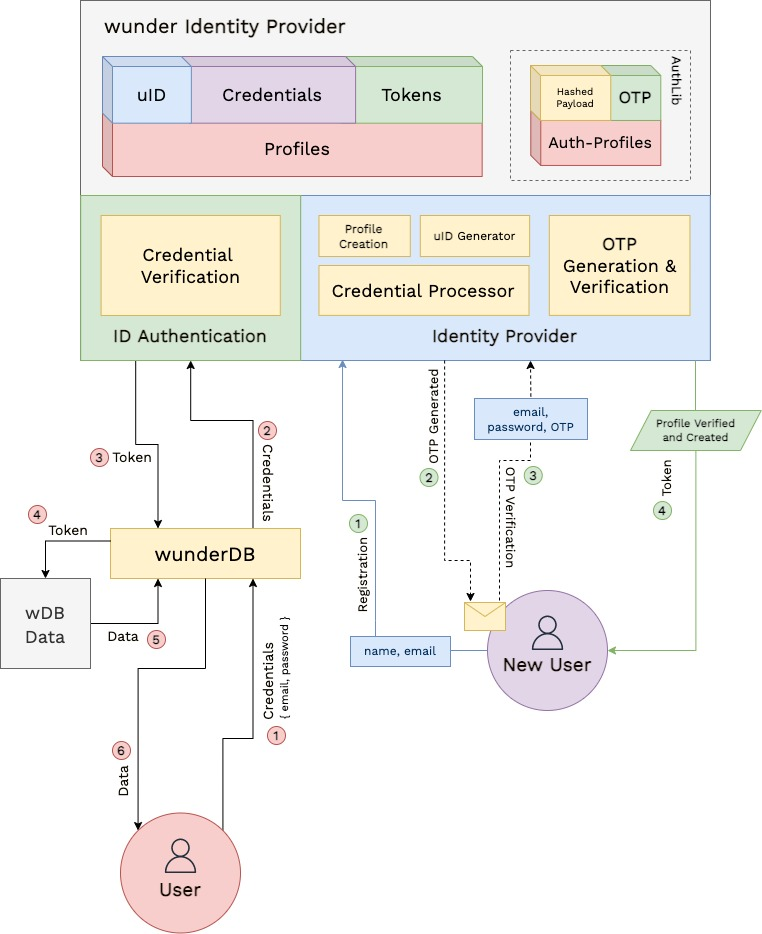
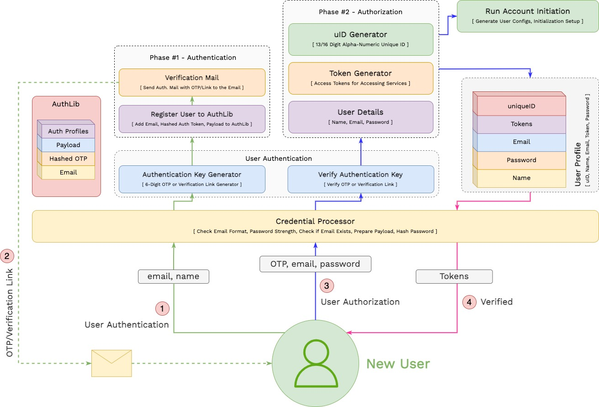
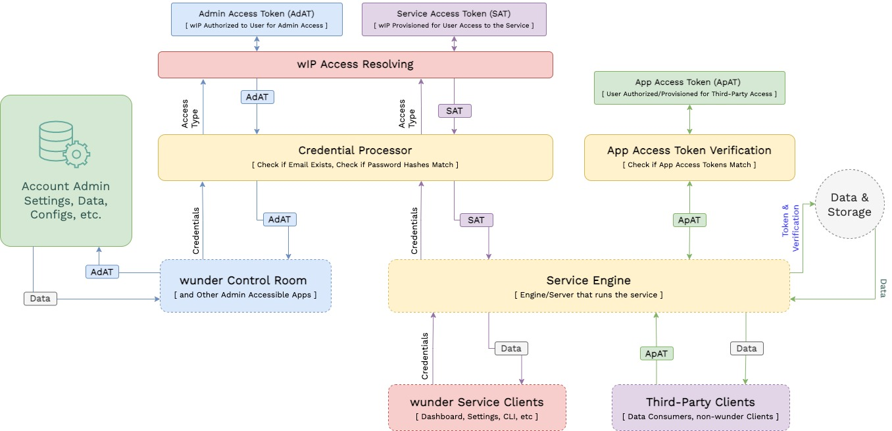

# wunder Identity Provider - wIP

`wunder Identity Provider` or `wIP` is Identity and Access Management System for all wunder Platform. The main goal of wIP is to streamline Access Control and to centralise Identity management across all wunder Platform products - wunderDB and any service developed going forward. 

`wIP` provides a platform for managing access simply by hooking new services with existing Identity and profile in the system.

## Architecture

The high-level architecture of `wIP` consists of two primary parts - Registration and Login. `wIP` does Authentication - of new Accounts and Authorization to End-Users and clients. 

# Registration

# Login

