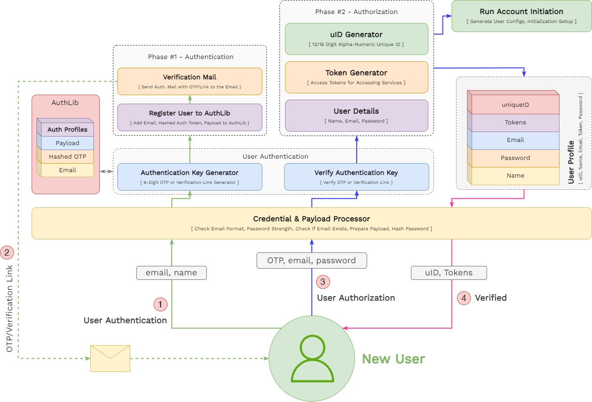

# wunder Identity Provider - wIP

`wunder Identity Provider` or `wIP` is Identity and Access Management System for all wunder Platform. The main goal of wIP is to streamline Access Control and to centralise Identity management across all wunder Platform products - wunderDB and any service developed going forward. 

`wunder Identity Provider` provides a platform for managing access simply by hooking new services with existing Identity and profile in the system.

The high-level architecture of `wIP` consists of two primary parts - Registration and Login. `wunder Identity Provider` does both `Authentication` - of new Accounts and `Authorization` - to End-Users and clients. 

### Architecture


# Identity Structure / Specification

## Identity Structure Specifications

**Identifiers** - `email` (user provided) & `uID` (wIP Generated)

**Credentials** - `email` & `password` (SHA256 Hashed)

## Identity Units 

Identity Units are various information bits that are stored for each user. These are provided by the user.

`Email` , `Name` , `Password` (hash)

## Authentication Units

These are various information, like - tokens and IDs that are uses for Authentication, Authorization and Access. These are generated by the system.

`uID` , `Admin Access Token` , `Core Service Configuration` ,  `Services Subscribed` , `Service Access Tokens`

## Complete Identity Structure

The following is a rough Identity Structure that will be implemented in wIP.

```
{
  "email" : <email> ,
  "user_uID" : <wIP Generated uID > ,
  "name" : <Name of User> ,
  "password" : <SHA-256 Hash of Password> ,
  "admin_access_token" : <wIP Provisioned Token> ,
  "services" : {
    "service_1" : {
      "service_ID" : < Same as uID> ,
      "service_name" : <Name of Service> ,
      "service_access_token" : <wIP Provisioned Token> ,
      "service_config" : <JSON describing a Initial Service Config, if any>
    },
    "service_2" : {
      "service_ID" : < Same as uID> ,
      "service_name" : <Name of Service> ,
      "service_access_token" : <wIP Provisioned Token> ,
      "service_config" : <JSON describing a Initial Service Config, if any>
    },
    ...
  }
}
```

Email is used as Primary Identifier for each user.  

```
{
  "email1@test.com" : {
    "email" : <email> ,
    "user_uID" : <wIP Generated uID > ,
    "name" : <Name of User> ,
    "password" : <SHA-256 Hash of Password> ,
    "admin_access_token" : <wIP Provisioned Token> ,
    "services" : {
      "service_1" : {
        "service_ID" : < Same as uID> ,
        "service_name" : <Name of Service> ,
        "service_access_token" : <wIP Provisioned Token> ,
        "service_config" : <JSON describing a Initial Service Config, if any>
      },
      "service_2" : {
        "service_ID" : < Same as uID> ,
        "service_name" : <Name of Service> ,
        "service_access_token" : <wIP Provisioned Token> ,
        "service_config" : <JSON describing a Initial Service Config, if any>
      },
      ...
    }
  },
  "email2@test.com" : {...},
  "email3@test.com" : {...},
  ...
}
```

# Registration



# Login


